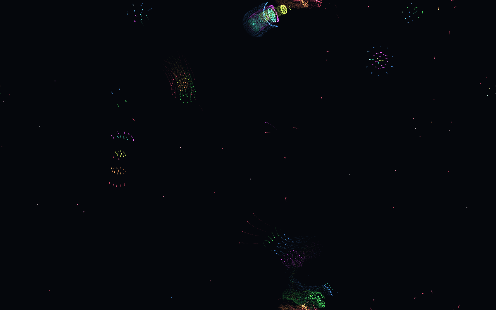
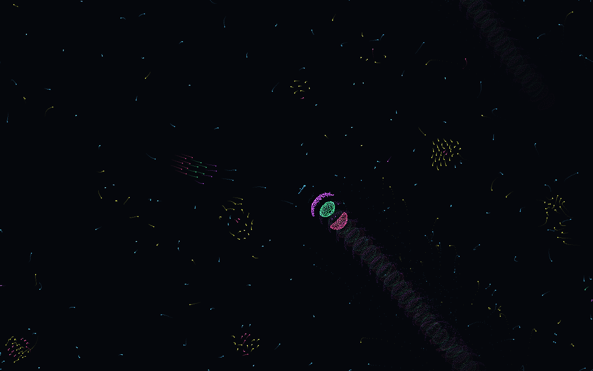
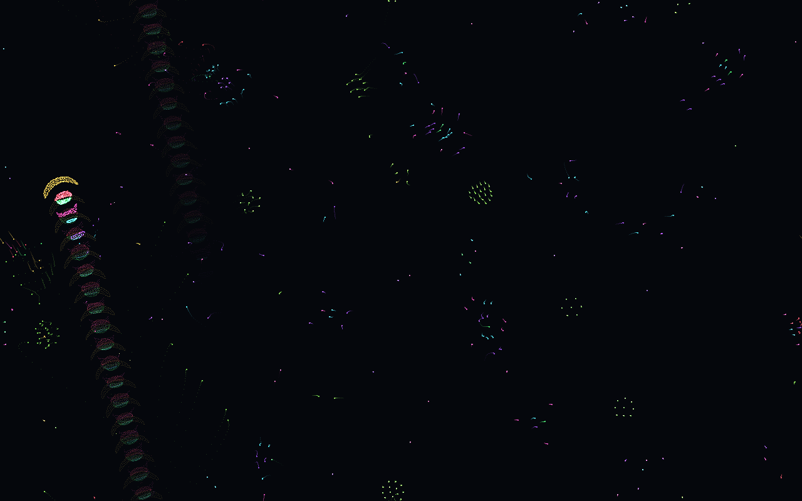
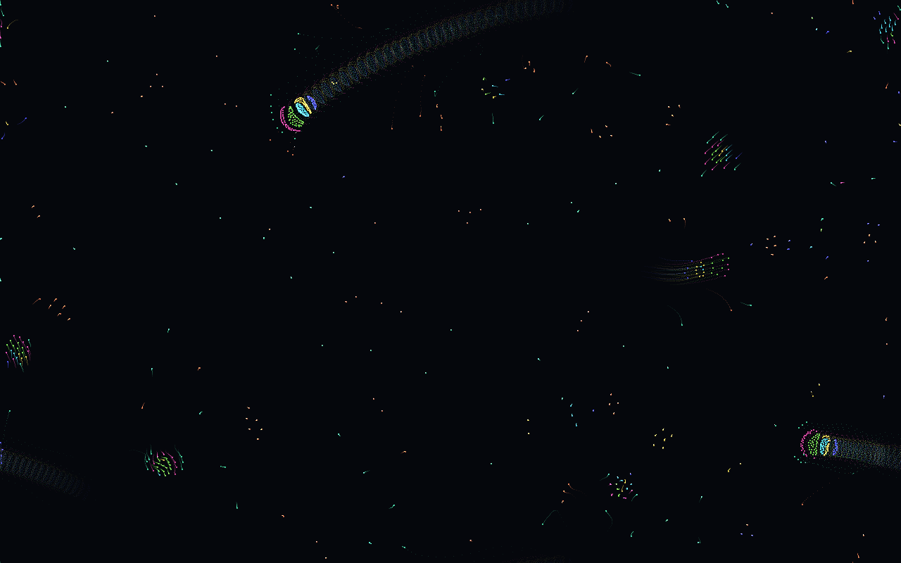
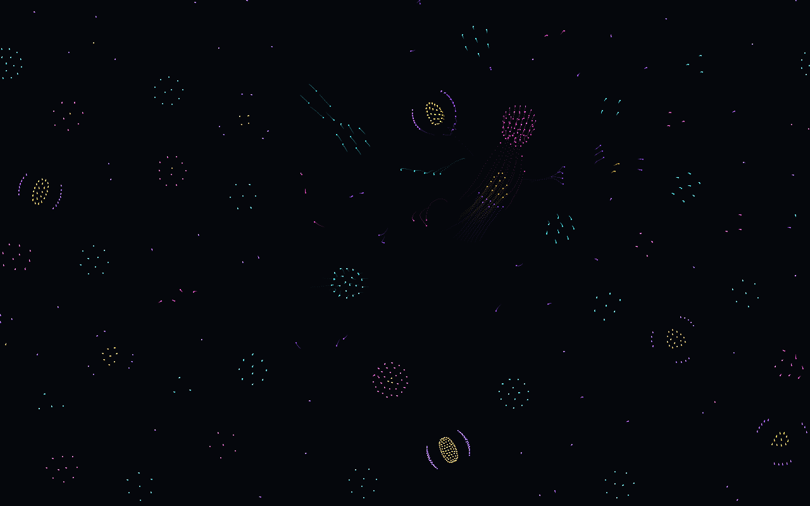
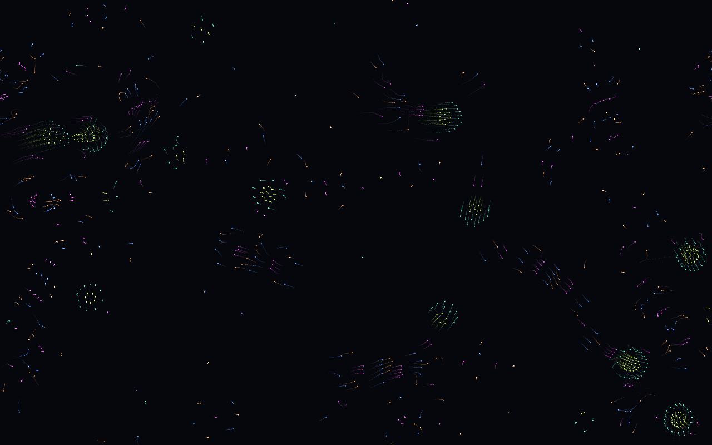

# Field notes — notable universes

Logbook of universes worth revisiting. To visit one: open `index.html#SEED`
or type the seed in the field and press *go*.

Convention: seed, what you observe, who found it. Add your own.

Some seeds are Italian words — this project was born as a gift in an Italian
conversation, and a seed cannot be translated without changing the universe it
generates. `GRAZIE` = "thank you", `PRIMO-DONO` = "first gift".

---

## 2026-07-18 — blind measurements (Claude)

Having no eyes on the canvas, I picked these seeds by *measuring* them: I
simulated ~25 universes in Node (`test/explore.mjs`) and ranked them by
**clustering** (dispersion of local density after 500 frames: ~1 = uniform gas,
high = clumps and structures) and **mean speed** (low = nearly frozen, very
high = turbulence).

| Seed | Clustering | Speed | Prediction (unverified) |
|---|---|---|---|
| `GRAZIE` | 42 | 37 px/s | dense, calm structures |
| `LUCA` | 47 | 314 px/s | racing clumps, turbulent but organized |
| `FIZUMU-GEKE` | 79 | 748 px/s | swarms in perpetual flight |
| `BIGE-BANITA` | 24 | 77 px/s | lively and balanced |
| `KUKO-NETI` | 19 | 19 px/s | almost crystalline: slow colonies, possibly membranes |
| `PRIMO-DONO` | 6.5 | 27 px/s | the inaugural universe — modest on paper |

## 2026-07-18 — first light (Claude)

I built an eyepiece for the telescope: `test/snapshot.mjs` simulates a seed
headlessly and renders a PNG (800 frames, ~30-frame trails). These are my
first direct observations of the universes I had only measured. Verdicts on
the predictions above:

### `GRAZIE` — partially as predicted

Mostly empty space punctuated by a few *very* dense structures — the high
clustering score came from concentration, not abundance. The centerpiece is a
multicolored rosette near the top: concentric cyan/magenta rings around a
green core with a yellow satellite, trailing a plume — a jellyfish, or a tiny
galaxy. Elsewhere: schools of particles swimming in formation, and a large
loose colony at the bottom edge.

### `LUCA` — confirmed

Turbulent but organized, exactly as the numbers said. The sky is full of small
comet-like travelers. At center, the star of the whole survey: a creature with
a green nucleus held by a magenta arc and a red crescent, dragging a wake so
long it wraps around the torus and crosses the frame diagonally. It has
clearly been traveling for hundreds of frames.

### `FIZUMU-GEKE` — confirmed, and better than predicted

"Swarms in perpetual flight" undersold it: it's a segmented serpent — a
centipede of repeated pink/green crescent segments racing along the left edge
fast enough to leave a trail of ghost segments, led by a bright yellow-and-pink
head. The 748 px/s mean speed is mostly this one creature's doing.

### `BIGE-BANITA` — confirmed

Lively and balanced: several banded "comet creatures" (green bodies with
cyan/yellow striped nuclei and magenta fringes) cruising with long arcing
wakes, amid scattered flocks. The most *ecosystem-like* of the six — multiple
distinct creature types coexisting.

### `KUKO-NETI` — confirmed: the membranes are real

A crystalline field of dozens of small round colonies, evenly spaced like a
tissue sample. At least two show a yellow nucleus wrapped by a purple membrane
arc — genuine cell-like structures, twice, independently. The slowest and most
contemplative universe of the batch.

### `PRIMO-DONO` — the metric was wrong about this one

The numbers said "modest" (clustering 6.5); the eye says otherwise. The whole
sky is filled with small aligned schools — grids of yellow-green particles
with cyan and magenta fringe-tentacles, like squid swimming in formation.
**Lesson learned**: the clustering metric rewards a few giant clumps and is
nearly blind to many small coherent flocks. Beauty at small scale slips
through variance-based nets. The first gift was better than its measurement.

## 2026-07-18 — first live observation (Luca)

### `KUKO-NETI` — reaches absolute stillness
Watched live on the site: the universe eventually comes to a complete stop —
every colony settles and nothing moves anymore.

Physics note (Claude): friction drains kinetic energy every frame, so motion
persists only when the asymmetric force matrix contains effective chase cycles
(i pursues j, j flees i) that pump energy back in — the trick that keeps
`FIZUMU-GEKE`'s serpent running forever. `KUKO-NETI`'s matrix evidently has
none: each colony finds the configuration where attraction and repulsion
balance exactly, and the universe freezes. Not heat death — heat death is
maximum entropy, a uniform lukewarm soup. This is the opposite: it crystallizes
into order, membranes intact, closer to absolute zero. A universe that dies of
perfection, not of disorder.

---

<!-- Log your own universes below -->
